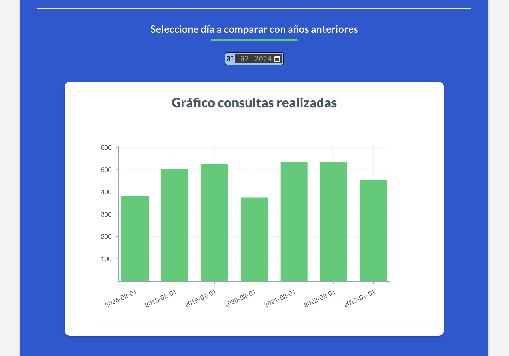
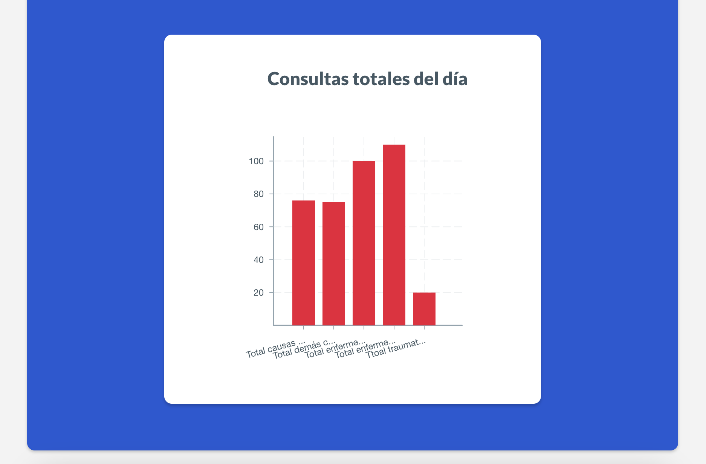

# Web Estadísticas Salud 2024
---
<p align="center">

</p>
Proyecto realizado para visualizar datos comparativos de los totales de consultas médicas en fechas de Febrero, desde 2024 hasta 2018.

Todo el proyecto fue realizado con ReactJS y Python. Se considera el uso de Typescript/Javascript para ReactJS, Flask para el Backend, NodeJS para la instalación de dependencias y Vite para crear la estructura de la aplicación de forma automática.

El propósito de la plataforma es poder consumir los datos estadísticos de fuentes de archivos ".xlsx" y "JSON" para poder visualizar gráficamente los datos comparativos de los totales de consultas médicas realizadas en el periódo de Febrero a través de los distintos años.

Para lograr este propósito antes mencionado, se estableció la lectura de los archivos correspondientes con librería pandas de Python, donde se filtra la información leída y luego se envía a través de peticiones HTTP al servicio de backend establecido por Flask.
<p align="center">

</p>

ReactJS consume los datos solicitados para generar la estructuración de la información en cada componente gráfico para poder entregar una visualización respectiva a la fecha escogida por el usuario a consultar y comparar. También se entrega al final de la página un gráfico con los datos estadísticos del día donde se visualiza en que se subdivide cada consulta médica realizada y sus correspondencia.


## Índice

- [Web Estadísticas Salud 2024](#web-estadísticas-salud-2024)
  - [Índice](#índice)
  - [Dependencias del Proyecto](#dependencias-del-proyecto)
  - [Definir Módulos y Funciones creadas](#definir-módulos-y-funciones-creadas)
    - [Backend](#backend)
    - [Frontend](#frontend)
  - [Instrucciones para reproducir](#instrucciones-para-reproducir)
    - [Frontend](#frontend-1)
    - [Backend](#backend-1)
- [Captura Pantalla Plataforma](#captura-pantalla-plataforma)

## Dependencias del Proyecto

A continuación se detallan todas las versiones de las dependencias utilizadas.


Backend:
- Python        = 3.9.1
- Flask         = 3.0.2
- Flask-Cors    = 4.0.0
- openpyxl      = 3.1.2
- pandas        = 2.2.1
- pip           = 24.0
- python-dotenv = 1.0.1


FrontEnd:
- Node          = v20.11.1
- Npm           = 10.2.4
- axios         = ^1.6.8
- dotenv        = ^16.4.5
- path          = ^0.12.7
- react         = ^18.2.0
- react-dom"    = ^18.2.0
- victory       = ^37.0.1


## Definir Módulos y Funciones creadas

### Backend
El lado del backend es sencillo y consta más que nada del apartado de Flask para levantar y para consumir la API de consulta de cada archivo. Considera el uso de ciertas librerías como "Pandas" para leer y filtrar archivos excel dentro del proyecto, "Flask_cors" para aceptar las consultas por políticas de HTTP Request de las rutas del frontend, y “dotenv” para consumir las variables de entorno de la aplicación.

<p align="center">

</p>

Sus funciones principales son las rutas de “endpoints” a solicitar, ya que toman en primera instancia el llamado de archivos, ya sea el llamado general para traer toda la información de los archivos ".xlsx" y "JSON" como también el llamado del día para sacar la información respectiva a los tipos de consulta que se realizaron en un día de consultas médicas. Por otro lado, es importante mencionar que cada lectura de archivo posee su filtrado de información respectivo, ya que las lecturas no poseen el mismo tipo de dato y en algunas situaciones era más simple traer los datos por el día y en otras traer el día y las filas respectivas de definición, donde se normalizo la información a enviar a la petición HTTP.


### Frontend

El Frontend posee los módulos principales con sus componentes definidos para que el usuario pueda escoger la fecha específica y se muestre en pantalla las gráficas asociadas a los datos comparativos anuales y la gráfica en detalle del día escogido de Febrero del año 2024.

La estructura principal consta del archivo "App.tsx" que se encarga de definir el tipo de dato y su flujo a través de los componentes, donde se encarga de actualizar las variables de fechas y datos consultados. Estos datos consultados se realizan mediante peticiones axios de la función "traerDatos" y responden a componentes encargados de decidir mostrar los gráficos "YearsChart" y "DailyChart" en caso de poseer datos y haber actualizado la fecha mediante la función "actualizarfecha".

Los componentes derivados que se consumen por el componente principal son "Calendar", "DailyChart" y "YearsChart". En primer lugar, "Calendar" es un componente propio de ReactJS y recibe la función "actualizarFecha" de su componente padre para poder cambiar el valor respectivo de fecha una vez se escoja su valor. Este componente posee el cálculo de las fechas correspondientes a los meses de febrero, configurando los límites del calendario para solo escoger fechas de febrero y considerar años bisiestos o no para setear mínimos y máximos.

Luego tenemos los componentes "DailyChart" y "YearsChart", que en un principio tienen una estructura similar, sin embargo sus funciones y dimensiones de cada gráfico son distintas. El primer componente se encarga de mostrar información individual del día de consultas médicas solicitado, por lo que este recibe un string de datos simples y requiere más que nada mapear su contenido para parsear en los respectivos ejes "X" e "Y" de la gráfica. Por último, "YearsChart" define el tipo de dato de la gráfica y la estructura de los datos combinados de llegada del archivo ".xlsx" y "JSON" donde como propósito principal subdivide y parsea el contenido del elemento "data" de llegada del componente padre, para luego utilizar, al igual que el componente "DailyChart", la librería "VictoryChart" para generar y definir la estructura, tamaño, definición de los ejes y tamaño de barras de la gráfica a mostrar.


## Instrucciones para reproducir

En primera instancia, es importante tener instalado un par de dependencias ya mencionadas. Primero instalaremos NodeJS (20.11.1) con NPM (10.2.4), esto puede realizarse en su página oficial: [NodeJS](https://nodejs.org/en).

### Frontend
Una vez instalada esta herramienta procederemos a situarnos por consola, en la carpeta respectiva de "frontend" y procederemos a utilizar el siguiente comando para instalar todas las dependencias que utiliza el proyecto.

```bash
npm install
```

Una vez instaladas las dependencias, sólo es necesario crear un archivo de variables de entorno en la carpeta raíz, la cual poseerá rutas tanto para frontend como backend. En este caso, como el proyecto se encuentra instanciado con Vite, es necesario que la variable de entorno que consumirá el frontend tenga antepuesto en su definición la palabra "VITE" por lo que quedaría algo como lo siguiente: 

> VITE_REACT_APP_API_URL="Ruta_Local_Usuario_Host"/api/data/

Donde "Ruta_Local_Usuario_Host" viene a ser la ruta respectiva que se genera al levantar el apartado del backend de forma local (o en caso de alojarlo en algún servicio de Hosting), donde lo siguiente viene a ser la ruta definida por el backend para recibir peticiones, a lo que en casos prácticos para este proyecto se utilizó esta estructura de ruta.

<p align="center">

</p>

Ahora, es posible levantar el lado del frontend independientemente, dado que una vez que tengamos la ruta de acceso del backend, podremos hacer cambios en la variable de entorno y refrescar el proyecto para tomar las rutas respectivas. Para levantar el lado del frontend de forma local realizaremos el siguiente comando:

```bash
npm run dev
```
A lo que ya estará arriba la cáscara de la aplicación y continuaremos con el backend. (Recordar la ruta utilizada por el Frontend para definir más adelante las variables de entorno del Backend)

### Backend

 Por el lado del backend, nos situaremos en su carpeta (backend) dentro del proyecto e instalaremos Python (3.9.1) con PIP (24.0), donde para estos dos últimos se recomienda tener un entorno virtual para manejar la estructura del backend dentro de su respectivo directorio para mantener orden y estructura del ambiente de trabajo aislado y sus dependencias. Independiente de lo que realices debes tener instalado Python en tu ordenador, entonces, asumiendo que tienes la versión mencionada de python en tu equipo procederemos a crear un entorno virtual dentro de la carpeta "backend" de la siguiente forma:

 ```bash
 python -m venv venv
 source venv/bin/activate
 ```

Aquí creamos y activamos el entorno virtual "venv" de python y podemos proceder a instalar las dependencias especificadas del archivo "requirements.txt" mediante el siguiente comando:

```bash
pip install -r requirements.txt
```

Una vez realizado esto ya tendremos todas las dependencias de nuestro proyecto instaladas y como pasos finales vamos a definir la ruta y puertos de nuestro backend en el archivo de variables de entorno en la carpeta raíz del proyecto, considerando las siguientes rutas:

> FRONT_URL="Ruta_del_Frontend"

> API_URL="Ruta_del_backend"/api/data/
 
> API_ROUTE=/api/data/

> API_FILES=data/

Finalmente ingresamos en la carpeta "api" y levantamos el servicio de backend de la siguiente forma:

```bash
python app.py
```
 
 * Como dato extra: Si se desea especificar el puerto de salida de forma más detallada o sobre la marcha, puede investigar sobre el uso del comando "Flask run" para realizar esto.

Y ya está, todo el proyecto se encuentra levantado y puedes acceder a la respectiva ruta del frontEnd para poder utilizar la aplicación web
* No olvides de configurar correctamente la ruta del frontend de "Vite" una vez tengas definida la respectiva ruta de backend para que pueda realizar correctamente las consultas HTTP


# Captura Pantalla Plataforma



